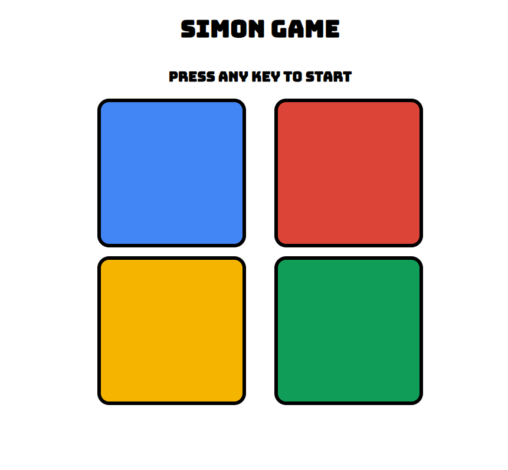

# Simon Says Game
Welcome to the Simon Says Game! This project is a simple implementation of the classic memory game using HTML, CSS, and JavaScript.

A web-based implementation of the classic Simon Says memory game.
## Play the Game 💜💛💙❤️
You can play the game [here](https://siniekoo19.github.io/Simon-Says-Game/).

## How to Play 🎮
  1. **Start the Game:**
     - To start the game, press any key on the keyboard.
  2. **Watch the Sequence:**
     - One of the four colored boxes will flash.
     - Remember the sequence of the flashed boxes.
  3. **Repeat the Sequence:**
     - Click the boxes in the same order as they flashed.
     - If you repeat the sequence correctly, the game will proceed to the next round and add another flash to the sequence.
  4. **Continue the Sequence:**
     - Each round adds a new box to the sequence.
     - Keep repeating the sequence correctly to advance to higher rounds.
  5. **Game Over:**
     - If you click the wrong box, the game ends.
     - Your score, which is the number of rounds you completed, will be displayed.
     - To restart the game, press any key on the keyboard again.

## Project Structure 🚀
The project consists of the following files:
  - **index.html:** The main HTML file containing the structure of the game.
  - **styles.css:** The CSS file for styling the game elements.
  - **script.js:** The JavaScript file that contains the game logic.

## GamePlay Mechanics
  - **Sequence Generation:** The game randomly selects one of the four boxes to flash in each round. The sequence of flashed boxes is stored and extended in each round.
  - **User Input:** Users must click the boxes in the exact sequence as they flashed. The game checks the user input against the stored sequence.
  - **Feedback:** The game provides visual feedback by flashing the body red to indicate the user entered the wrong sequence and displays the current score with a game over message when applicable.
  - **Responsive Design:** The game is designed to be responsive. On smaller screens (less than 600px), a "Start" button will be displayed. Once the game starts, the button will disappear, and the level information will be displayed. If the user inputs a wrong sequence, the game over message will be displayed, and the user can restart the game by pressing the "Start" button again.

## 🚀 About Me
👋 Hi there! I'm Sinchana Chatterjee, an enthusiastic and determined B.Tech student with a fervent aspiration to excel as a Web Developer.

## Authors
[@siniekoo19](https://github.com/vikasbhosale-45)

## Acknowledgments
- Thanks to [githubs pages](https://siniekoo19.github.io/Simon-Says-Game/) for providing a platform to deploy my website.
- Thanks to the open-source community for their invaluable contributions to the tools and libraries used in this project.

## Feedback
If you have any feedback, please reach out to me at vikasbhosale161@gmail.com
